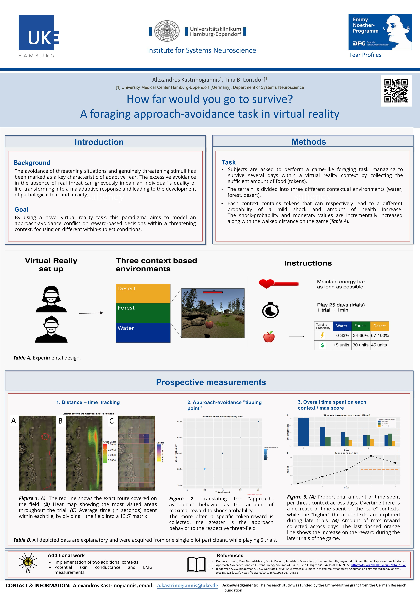

```{r, message=FALSE, echo=FALSE, warning=FALSE}
library(knitr)
library(tidyverse)
library(here)       # for relative paths
library(apa)        # transforms results of tests in apa-style
library(kableExtra) # for nice tables
library(usethis)    # version control with git/github
```

### In this project Nina Akmann & Linus Krause are creating cooperatively a codebook for survey data.

Avoidance is typically considered a maladaptive behavioral response to excessive fear and anxiety, potentially leading to the maintenance of anxiety disorders. Recent experimental work has focused on approach-avoidance (AA) conflicts by simulating foraging tasks under predation, often targeting on decision making strategies. However, little has been known about the impact of individual differences upon the AA strategies within a threatening environment. Here, we present a novel avoidance paradigm , in which an immersive AA conflict is induced in a virtual foraging task. The task is built on a matrix designed environment, which enables us to track and visualize the AA-behavior as a function of spatial movement. Individuals are required to survive a five-day period (blocks) by collecting the necessary amount of food (tokens) within three different nature-related terrains (forest, sea, desert). Each terrain, however, is assigned to a different probability of encountering an aversive (electrical) stimulus in combination with being struck by lightning in the virtual environment while collecting a token. The probabilities of receiving the unpleasant stimulus are parametrically graded to the covered distance along the terrain. In order to encourage approach behaviour, the amount of potential reward is inversely parametrically modulated to the probability of receiving the aversive stimulus. Thus, each individual is required to perform a certain approach-avoidance strategy to achieve the task's goal, as to the time spent in each terrain and the spatial movement along the field. Each strategy behaviour results in a unique "tipping point" between the traversed distance and the maximum achieved reward, revealing the extent to which each individual is willing to approach or to avoid a threat as a trade-off for better performance (reward).



```{r poster Alex, message=FALSE, echo=FALSE, fig.cap="Poster Alexandros Kastrinogianis", out.width = '100%', dpi=300}


include_graphics(here("images/indexRmd_EMHFC_poster_Alexandros_Kastrinogiannis.jpg"))
# trying to solve the problem of relative paths

```

## Psychometrics

### The State-Trait Anxiety Inventory (STAI)

**Construct:** Adult anxiety

**Description of Measure:** The State-Trait Anxiety Inventory (STAI) is a commonly used measure of trait and state anxiety (Spielberger, Gorsuch, Lushene, Vagg, & Jacobs, 1983). It can be used in clinical settings to diagnose anxiety and to distinguish it from depressive syndromes. It also is often used in research as an indicator of caregiver distress (e.g., Greene et al., 2017, Ugalde et al., 2014).

Anxiety Form Y, its most popular version, has 20 items for assessing trait anxiety and 20 for state anxiety. State anxiety items include: "I am tense; I am worried" and "I feel calm; I feel secure." Trait anxiety items include: "I worry too much over something that really doesn't matter" and "I am content; I am a steady person." All items are rated on a 4-point scale (e.g., from "Almost Never" to "Almost Always"). Higher scores indicate greater anxiety. The STAI is appropriate for those who have at least a sixth-grade reading level.

Internal consistency coefficients for the scale have ranged from .86 to .95; test-retest reliability coefficients have ranged from .65 to .75 over a 2-month interval (Spielberger et al., 1983). Test-retest coefficients for this measure in the present study ranged from .69 to .89. Considerable evidence attests to the construct and concurrent validity of the scale (Spielberger, 1989).

Studies also have shown that it is a sensitive predictor of caregiver distress over time, and that it can vary with changes in support systems, health, and other individual characteristics (Elliott, Shewchuk, & Richards, 2001; Shewchuk, Richards & Elliott, 1998).

[@StateTraitAnxietyInventory]

### BIS/BAS scales

Several theorists have argued that two general motivational systems underlie behavior. A behavioral approach system (BAS) is believed to regulate appetitive motives, in which the goal is to move toward something desired. A behavioral avoidance (or inhibition) system (BIS) is said to regulate aversive motives, in which the goal is to move away from something unpleasant. We developed the BIS/BAS scales to assess individual differences in the sensitivity of these systems.

*Carver, C. S., & White, T. L. (1994). Behavioral inhibition, behavioral activation, and affective responses to impending reward and punishment: The BIS/BAS scales. Journal of Personality and Social Psychology, 67, 319-333.*

Each item of this questionnaire is a statement that a person may either agree with or disagree with. For each item, indicate how much you agree or disagree with what the item says. Please respond to all the items; do not leave any blank. Choose only one response to each statement. Please be as accurate and honest as you can be. Respond to each item as if it were the only item. That is, don't worry about being "consistent" in your responses. Choose from the following four response options:

-   1 = very true for me
-   2 = somewhat true for me
-   3 = somewhat false for me
-   4 = very false for me

[@DepartmentPsychologyBIS]

### Intolerance of Uncertainty Scale (IUS)


